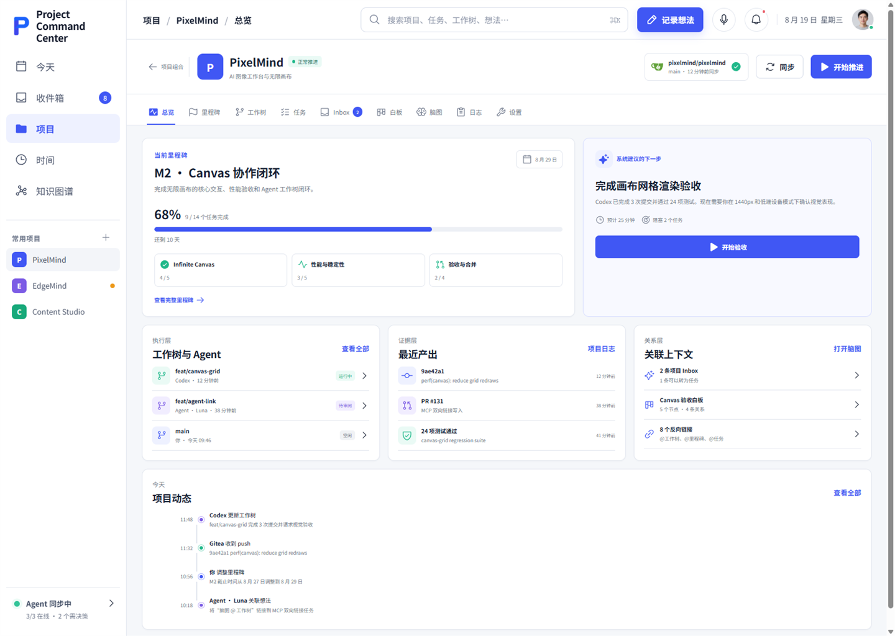
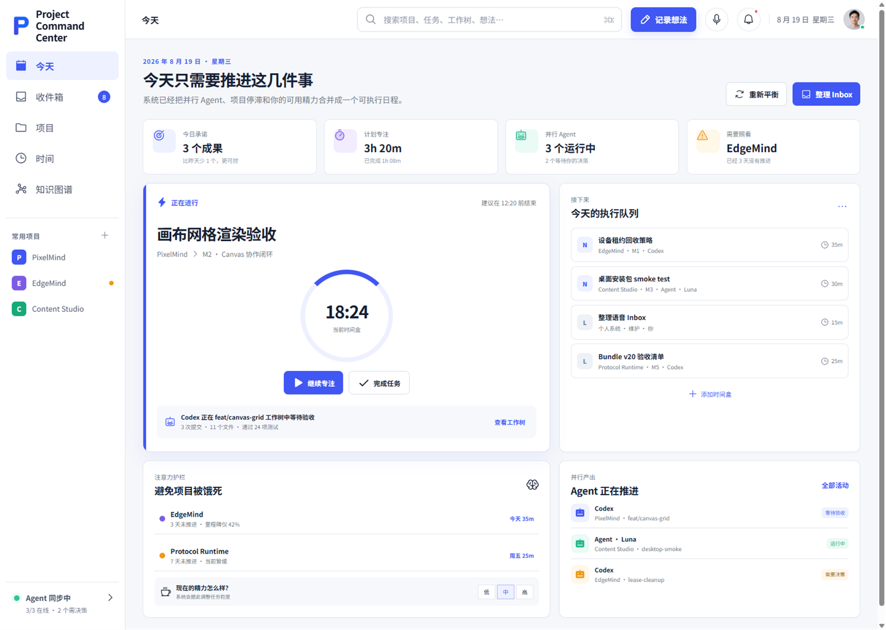
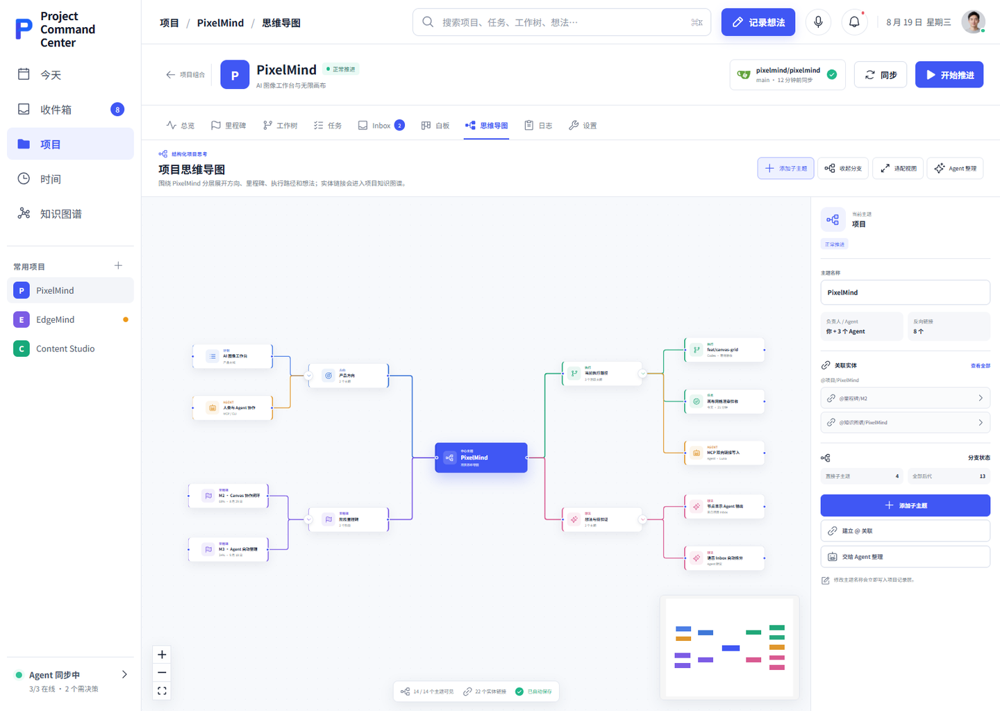
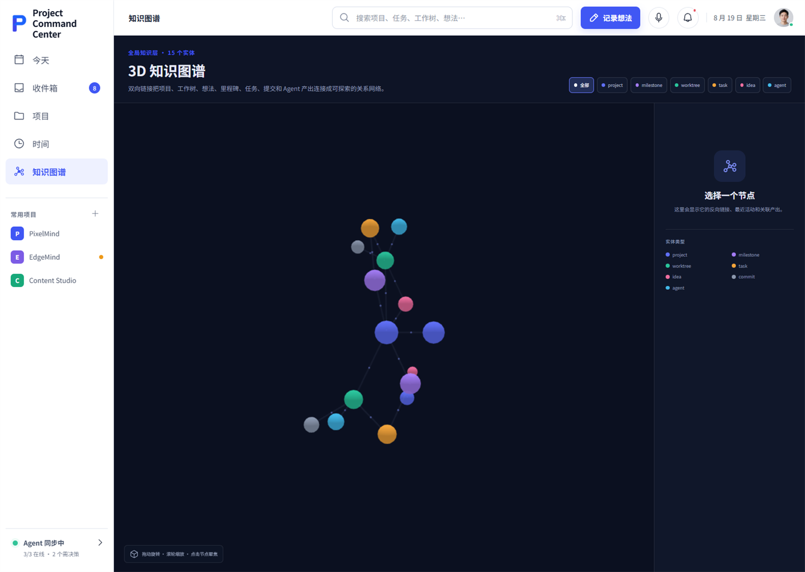
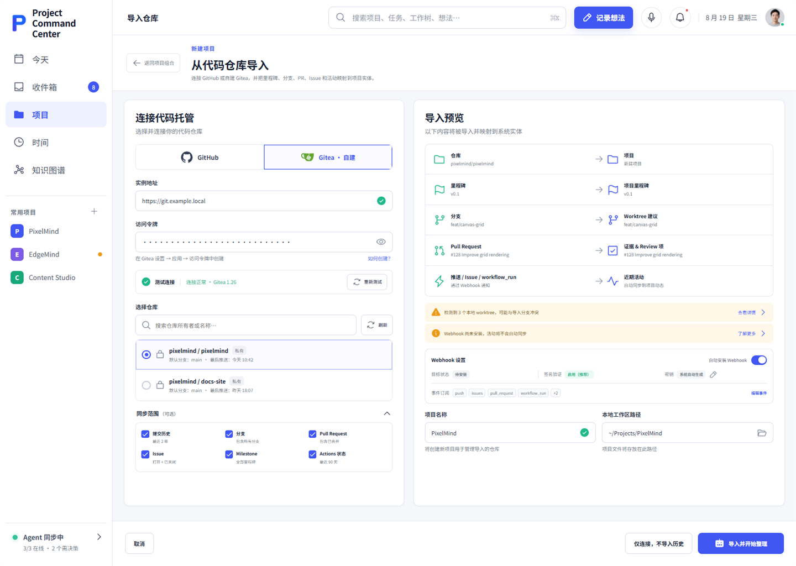

# Agentic Project OS

> **人与 AI 的最佳协作模式是由看板驱动 Agent。**

**Agent-native project management for humans and AI agents.** 一个本地优先、可自部署的项目管理系统，把想法、任务看板、里程碑、时间投入、Git 工作树和 Agent 活动关联到同一份项目事实中。Web、桌面端、CLI 与 MCP 共享数据；关键结构变更由人确认。

Agentic Project OS 面向同时推进多个项目的独立开发者，也为未来的团队协作预留扩展空间。它帮助你在思路清晰时快速捕获需求，在注意力低谷时知道今天该推进什么，并能回溯 Agent 的工作与真实 Git 产出。

> 当前版本已经具备任务看板、MCP/CLI、只读 Organizer 与 Proposal 决策流程。**看板自动调度不同 Agent harness** 是产品方向，列在下方的未来里程碑中。

## 🌍 English overview

**Agentic Project OS** is a local-first, self-hostable project management system built for people and AI agents working across multiple projects. Its guiding idea is simple: **the best human–AI collaboration is driven by a task board that gives agents clear work and gives people clear decisions.**

It brings ideas and inboxes, milestones and plans, task boards, focus time, Git worktrees and commits, and agent activity into one connected, auditable workspace. GitHub and self-hosted Gitea are supported. Mind maps and a 3D knowledge graph help you explore relationships without losing the underlying project structure.

Today, agents can read shared context and submit controlled updates or proposals through the CLI and STDIO MCP interface. A read-only, event-driven Organizer suggests changes; people review structural decisions. Automatic dispatch across different agent harnesses is **planned, not yet implemented**. The roadmap below covers broader Playwright testing, team permissions, and adapters for Pi Agent, WorkBuddy, Claude Code, and OpenClaw.

The full feature list, setup guide, architecture, and roadmap continue below in Chinese. The project is released under [Apache License 2.0](LICENSE).

## 📸 产品截图

以下是使用示例数据制作的早期界面截图。截图中可能出现旧品牌文字；当前产品名称以本页和运行中的应用为准。



<details>
<summary>查看更多界面：今天、思维导图、知识图谱、仓库导入</summary>

### 今天：跨项目执行与专注



### 项目思维导图



### 3D 知识图谱



### GitHub / Gitea 仓库导入



</details>

## 🧭 它解决什么问题

多个项目与多个 Agent 并行时，想法散落在聊天和笔记里，任务状态与代码现场脱节，时间被单个项目吞掉，其他项目却悄悄失速。Agentic Project OS 把这些线索接成一个可查看、可搜索、可审计的循环：

```text
记录想法 → 总 Inbox / 项目 Inbox → 整理与 Proposal → 人确认 → 里程碑 / 计划 / 任务看板
                                                       ↓
项目总览 ← 日志、时间与 Git 证据 ← 工作树 / Commit / Agent 活动 ← 执行任务
```

人负责目标、优先级与决策；Agent 通过 MCP/CLI 读取同一项目上下文，捕获明确的低风险信息，对层级、期限、合并或排程提出 Proposal。任务看板成为双方交接工作的共同界面。

## 🌳 项目树与关系

项目的稳定层级只有四层，方便人理解，也方便 Agent 定位：

```text
Workspace
└── Project                 项目
    └── Milestone           里程碑：阶段成果与期限
        └── Plan            计划：如何完成阶段成果
            └── Task        任务：可执行、可分配、可验收的工作
```

Inbox 条目、想法、工作树、Commit、负责人、时间块、思维导图节点和 Proposal 通过双向实体链接连接到这棵树，不额外增加树的层级。例如，一个任务可以关联执行它的 Agent、工作树、专注记录和提交；一个思维导图节点可以 `@` 一个里程碑或工作树。3D 知识图谱由这些真实链接生成。

## ✨ 已实现的功能

| 视图 / 能力 | 当前可做的事 |
|---|---|
| 🗓️ 今天与时间 | Now / Next / Later、日周时间画布、专注计时、项目时间预算、低能量重新平衡建议与失速提醒。 |
| 📂 项目组合 | 新建、编辑、筛选、收藏、归档项目；汇总里程碑、任务、真实投入、阻塞与最近活动。 |
| 🎯 里程碑与任务看板 | `Project → Milestone → Plan → Task` 层级；任务拖动、批量操作、负责人/Agent、期限、依赖、进度和完成证据。 |
| 📥 Inbox 与想法库 | 全局/项目分别收集；文本和语音输入；整理、去重、合并；把想法升级为里程碑、计划或任务，并保留来源关系。 |
| 🌿 Git 与工作树 | 绑定本地项目目录，读取分支、HEAD、dirty、ahead/behind、改动文件和提交；发现工作树、关联任务与 Agent。 |
| 🔗 GitHub / Gitea | 连接远程仓库；同步 Commit、Branch、PR、Issue、Milestone；Webhook 验签、防重放、进度与失败续跑。 |
| 🧠 思维导图与图谱 | 项目思维导图增删改、折叠、重排、`@` 实体；项目与全局知识图谱支持搜索、聚焦、邻居查看及跳转。 |
| 🤖 Agent 接口 | STDIO MCP 与 CLI 共用后端；项目快照、跨实体搜索、Inbox/Idea 捕获、实体链接与 Proposal 提交。 |
| 🧩 Organizer 与决策 | 事件驱动的只读整理器生成建议；待决策中心显示依据和影响，支持接受、修改后接受与拒绝。 |
| 📜 日志、通知与备份 | 事件日志、可解释日报、可操作提醒；SQLite 在线备份、迁移包与恢复前保护点。 |
| 🖥️ 桌面与自部署 | React Web、Electron Windows 安装版/便携包、本机 daemon、自托管运行与本地加密凭据。 |

功能边界和验收依据见 [功能矩阵](docs/feature-matrix.md)。项目白板保留兼容数据/API，但已从首版导航撤下；首版聚焦任务看板、思维导图与知识图谱。

## 🚀 快速开始

需要 Node.js 22.20+、pnpm 10.28+ 和 Git。首次在仓库根目录安装并构建共享包：

```bash
pnpm install --frozen-lockfile
pnpm build
```

分别打开两个终端运行后端与 Web：

```bash
pnpm dev:daemon
```

```bash
pnpm dev:web
```

打开 `http://127.0.0.1:4173`；后端健康检查为 `http://127.0.0.1:4317/health`。开发数据默认保存在仓库根目录 `.data/`，并已被 Git 忽略。Vite 将 `/api` 与 `/health` 代理到本机 daemon。

常用命令：

```bash
pnpm check                              # 类型检查 + 测试 + 构建
pnpm --filter @pcc/cli dev -- status    # 查看 daemon 状态
pnpm --filter @pcc/cli dev -- projects  # 查看项目列表
pnpm --filter @pcc/desktop dev          # 运行 Electron 开发版
pnpm --filter @pcc/desktop make         # 构建 Windows Setup 与 ZIP Portable
```

### 首次使用建议

1. 在「项目」中新建项目，设置目标和当前里程碑；也可以从 GitHub 或自托管 Gitea 导入仓库。
2. 绑定本地项目文件夹，读取 Git 与 Worktree 状态。
3. 在「收件箱」记录尚未整理的想法，或在项目 Inbox 中记录归属明确的需求。
4. 将需求整理为 `Milestone → Plan → Task`，在任务看板上明确状态、负责人和验收条件。
5. 在「今天」安排时间块和专注；在待决策中心审核 Agent 提出的结构变化。

## 🤖 Agent 与 Codex 接入

构建后可注册 Codex MCP：

```bash
node apps/cli/dist/index.js integrate codex
```

其他支持 STDIO MCP 的客户端可以配置命令 `node ABSOLUTE_PATH/apps/cli/dist/index.js mcp`。CLI/MCP 会检查本机 `projectd`，必要时自动拉起；它们与 Web 共用 SQLite、服务命令和审计日志。自定义服务地址可通过 `PCC_DAEMON_URL` 配置。

CLI 示例：

```bash
node apps/cli/dist/index.js projects
node apps/cli/dist/index.js project snapshot PROJECT_ID
node apps/cli/dist/index.js search "Webhook" --project PROJECT_ID
node apps/cli/dist/index.js inbox add "整理 Gitea 导入错误态"
node apps/cli/dist/index.js idea add PROJECT_ID "补充里程碑验收标准"
```

MCP 工具分为读取项目/工作树/搜索、捕获 Inbox/Idea、建立实体链接、提交 Proposal。Organizer 在事件触发后读取边界快照并生成 Proposal；里程碑、任务移动、合并和排程等结构变化需要人在待决策中心确认。工具名与完整命令见 [MCP 与 CLI](docs/mcp-cli.md)。

## 🧱 架构与仓库目录

```text
React Web / Electron
        │ REST + SSE
        ▼
projectd (Fastify)
  ├─ Query / Command Services
  ├─ SQLite WAL + FTS5 + Event Log
  ├─ Git / GitHub / Gitea / Voice Connectors
  ├─ Read-only Organizer → Proposal
  └─ Backup / Restore Bootstrap
        ▲
        │ local HTTP
projectctl / STDIO MCP / Codex / other Agents
```

```text
agentic-project-os/
├── prototype/           React + Vite Web、页面与产品截图
├── apps/
│   ├── daemon/           Fastify API、事件流、连接器与 Organizer
│   ├── cli/              projectctl 与 MCP 入口
│   └── desktop/          Electron 桌面端和 Windows 打包
├── packages/
│   ├── contracts/        Zod 契约
│   ├── domain/           领域规则和事件
│   ├── database/         SQLite、迁移与仓储
│   └── mcp/              MCP Server 与 daemon client
└── docs/                 架构、部署、安全和功能验收
```

数据写入遵循同一条路径：Web、CLI 或 MCP 发起命令，后端校验后更新数据库并记录事件，SSE 刷新界面；Organizer 只读取快照并生成可审计的建议。更详细的领域边界见 [架构说明](docs/architecture.md)。

## 🔐 数据、安全与自部署

- 默认只在本机回环地址运行 daemon、桌面站点和 MCP；数据在本地 SQLite 中持久化。
- GitHub、Gitea、Webhook 和语音 API 凭据由本机密钥加密保存；密钥不返回给 UI/MCP。
- Git 工作区扫描读取元数据；Organizer 的快照不包含源文件正文和密钥。
- 可通过界面创建 SQLite 在线备份、导出迁移包，并在恢复前做哈希与数据库完整性预检。
- 支持自托管 Gitea、GitHub Webhook 和 Windows 桌面打包；跨机器开放 API 时需自行配置 TLS、访问控制和防火墙。

环境变量、Gitea/Webhook、备份与 Windows 发行步骤见 [自部署指南](docs/self-hosting.md)，权限细节见 [安全模型](docs/security.md)。

## 🗺️ 下一阶段里程碑

以下是计划，未计入上方「已实现」列表。顺序表示优先级，不表示已经承诺发布日期。

1. **M1 · 完善测试与 Playwright 端到端覆盖**：补充关键业务路径、错误态与迁移回归测试；建立隔离样例数据、跨页面 Playwright 流程、截图/Trace 失败证据及 CI 门禁。
2. **M2 · 团队与权限**：引入成员、团队、项目级角色与授权；区分人类和 Agent 身份，记录操作归属，并让共享项目的读写、审批和连接器权限可配置。
3. **M3 · 更多 Agent harness**：在现有 MCP/CLI 接口上适配 Pi Agent、WorkBuddy、Claude Code、OpenClaw 等；统一会话/运行状态、任务交接和产出回写，并让看板逐步承担跨 harness 调度入口。

## ❤️ 赞助

Agentic Project OS 由 **铭柯文化** 赞助。社区赞助位也会用于展示支持项目持续维护、兼容性测试、文档和跨平台发行的伙伴。

| 🥇 首席赞助 | 🤝 社区赞助位 |
|---|---|
| [**铭柯文化**](https://mingke.media) · [mingke.media](https://mingke.media) | **期待你的名字出现在这里** |
| 项目发起方 | 赞助入口与展示信息待开放 |

## 🤝 参与贡献

欢迎提交 Issue 和 Pull Request。请先阅读 [CONTRIBUTING.md](CONTRIBUTING.md)，提交前运行 `pnpm check`；涉及界面的变更请附对应路由的截图或 Playwright 证据。功能状态与可验证范围以 [功能矩阵](docs/feature-matrix.md) 为准。

## 📄 许可证

项目代码以 **Apache License 2.0（Apache-2.0）** 发布，完整条款见 [LICENSE](LICENSE)。该协议允许使用、修改、分发及商用，也允许在遵守协议条件的前提下发布闭源衍生版本；再分发时须保留相关许可与版权声明，并标明已修改的文件。具体义务以许可证原文为准。

依赖和第三方素材各自遵循其原有许可。当前 `@pcc/*` 包作用域、`PCC_*` 环境变量、`projectctl`、`projectd` 与已有数据文件名是兼容标识；公开产品名为 **Agentic Project OS**。

## 📣 声明

Claude Code 全程没有参与本项目的开发。Claude Code did not participate in developing this project.
